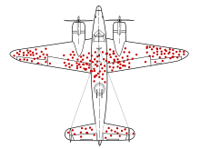

## Instructor(s) name(s) and contact information

Chloe Mirzayi, [cmirzayi\@gmail.com](mailto:cmirzayi@gmail.com){.email}

Levi Waldron, [levi.waldron\@sph.cuny.edu](mailto:levi.waldron@sph.cuny.edu){.email}

CUNY School of Public Health, 55 W 125th St, New York, NY 10027 USA

```{r, message = FALSE}
library(curatedMetagenomicData)
library(dagitty)
library(DESeq2)
library(phyloseq)
library(ggdag)
library(mia)
```

## Smoking and lung cancer: the most famous causal inference problem

Though the idea that smoking causes lung cancer is a well-accepted fact these days, it was an incredibly controversial theory in the 1950s and 60s. The statistician RA Fisher (who developed ANOVA, the F-distribution, and more) believed that smoking ***did not***cause lung cancer, arguing that correlation does not necessarily mean causation.

Questions to consider during this workshop:

1.  If you wanted to prove Fisher wrong and demonstrate smoking causes lung cancer, how would you do so?
2.  One of Fisher's main arguments was that there was a genetic factor that was correlated with both smoking behaviors and lung cancer. He argued that this genetic factor was what was truly causing lung cancer in smokers. How would you test this theory?

## Goals and Outline

-   Introduce fundamental concepts of causal inference

-   Discuss how to make directed acyclic graphs (DAGs) and how to use them when analyzing data

-   Explore concepts of bias and confounding

-   Review common study designs and their implications for causal inference

-   Briefly survey tools in R that can help with causal inference

## Introduction: Just what is a cause anyway?

**Question:** In your own words, what is a cause? What does it mean to cause something?

How do we know our potential cause brought about an effect or a result? Perhaps it preceded the effect of interest. However, it could still just be a coincidence. Perhaps there is a lurking variable that truly causes both what we think is the cause and the observed effect.

Despite this, humans (and animals) tend to have a relatively intuitive understanding of causation when we observe it directly. When I burn my finger while cooking, I know what caused it--my finger coming into contact with a hot stove. I could also trace the causal pathway backward and identify what caused my finger to come into contact with the hot stove in the first place--such as my motivation to cook dinner or me being distracted by the antics of my cat.

**Question:** What are some causal questions we may be interested in within the context of Bioinformatics (or your field of work/study/research)?

## The counterfactual definition of a cause

However, the nature of much of the work I and many Bioinformaticians do does not allow us to directly observe what caused an event of interest. Instead we must rely on inferences we draw from our data to establish an argument for a particular causal mechanism or pathway.

Rather than relying on vague dictionary definitions to inform the science of causal inference, the most commonly accepted definition of a cause in modern epidemiology is based on a counterfactual: *what would have happened had the event of interest had the exposure not occurred*.

But that's not very intuitive or easy to parse so let's consider an example:

### Example: A dog and an ambulance

An ambulance drives by a house with its sirens on. A dog in the house's yard barks. We can ask the causal question in a straightforward way: **Did the ambulance driving by the house cause the dog to bark?**

Alternatively, we can rephrase the question in terms of a counterfactual: Would the dog have barked if the ambulance had not driven by the house?

### More examples of causal questions rephrased as counterfactuals

"Does the vaccine increase the risk of blood clots?" -\> "Would people have developed blood clots if they had not been given the vaccine?"

**Question:** Using the causal question from Bioinformatics or your field, reframe it in terms of a counterfactual?

## DAGs

We can visualize the relationship using a causal diagram also called a directed acyclic graph (DAG).

```{r, echo = FALSE, fig.height=1, fig.width=3}
cd1 <- dagitty( "dag {
  Ambulance -> Dog_Barking
}")
coordinates(cd1) <- list(x=c(Ambulance=1, Dog_Barking=2),
                         y=c(Ambulance=0, Dog_Barking=0))
plot(cd1, height=1)
```

This diagram depicts the cause or exposure (the ambulance) and the effect or the outcome (the dog barking) with an arrow indicating the direction of the causal relationship. In contrast to a diagram showing a statistical relationship, causal diagrams must state a directional relationship because we are theorizing that one variable causes another.

This is the simplest form of a causal diagram. If we were to statistically model the effect for this relationship using regression, a simple two-variable model containing the exposure and the outcome would give us a correct, unbiased estimate of the actual strength of the cause on the effect. However, we are rarely that lucky.

**Question**: Can you think of any situations that may bias the observed relationship between the ambulance and the dog barking?

## Making DAGs

There are several options for making DAGs. We could draw them by hand on a piece of paper or in software that allows us to make diagrams. But there are specialized options available online and in R we can use instead.

### Dagitty

Dagitty offers both an online version (<http://www.dagitty.net/>) and an R package. The online version provides a user interface. You can also export the diagram from the online interface to R.

**Demo:** Dagitty online and export to R

```{r, fig.height=1, fig.width=3}
dag_export <- dagitty( 'dag {
bb="0,0,1,1"
age [pos="0.258,0.073"]
genetics [pos="0.416,0.539"]
lung_cancer [outcome,pos="0.607,0.288"]
pollution [pos="0.261,0.178"]
smoking [exposure,pos="0.265,0.291"]
age -> lung_cancer
genetics -> lung_cancer
genetics -> smoking
pollution -> lung_cancer
smoking -> lung_cancer
}')

plot(dag_export, height=1)
```

### ggDag

```{r, fig.height=3, fig.width=6}
ggdag(dag_export, node_size = 18, text_col="red")+theme_dag_blank()
```

**Exercise 1:** Make the DAG for a causal question of interest. Then export it to R. Using dagitty and ggdag, try adjusting different aspects of it (position, color).

## Bias and Confounding

### Confounding

Confounding arises when a third variable is present in the relationship between cause-and-effect. A confounder is present when:

1.  The confounder causes the outcome
2.  The confounder causes the exposure
3.  The confounder is not a mediator (i.e. it is not present on the causal pathway between the exposure and the outcome)

Returning to our example, the relationship between the ambulance and the barking dog could be confounded by a third variable: a nearby car crash. Perhaps this car crash is what started the dog barking before the ambulance even arrived, but the ambulance caused the dog to bark even more.

```{r, echo = FALSE, fig.height=1.5, fig.width=3}
cd2 <- dagitty( "dag {
  Ambulance -> Dog_Barking
  Car_Crash -> Ambulance
  Car_Crash -> Dog_Barking
}")
coordinates(cd2) <- list(x=c(Ambulance=1, Dog_Barking=3, Car_Crash=2),
                         y=c(Ambulance=0, Dog_Barking=0, Car_Crash=1))
plot(cd2)
```

The pathway between the exposure and the outcome through the confounder is called a "backdoor pathway" and it can bias the relationship between the exposure and the outcome you observe. In this situation, we might observe barking and conclude that it occurred due to the ambulance when in fact it was due to the car crash. Or we might conclude that the volume of the barking caused by the ambulance alone is much greater than it actually is due to the combined effect of both the car crash and the ambulance.

**Question:** What are some common confounders in bioinformatics or health research?

We can "deconfound" the effect of interest by controlling for the confounder. The old-fashioned way of doing this is to manually stratify your data by levels of the confounder. Then you calculate an effect size for each stratum then calculate a weighted average across strata. You may have been exposed to this statistical method in a biostatistics course as a Cochran-Mantel-Haenszel statistic.

In a regression model, we can include the confounder as an independent variable in our model and it is controlled for. When we include the confounder as a variable in a regression model, we are effectively stratifying the effect across different levels of the confounder then taking the weighted average across strata to get an effect size.

**Exercise 2:** Using your DAG for a causal relationship of interest to you, consider potential confounders.

#### Unmeasured confounding

A common issue in observational studies is that there may be confounders that you are not aware of or did not assess. Unmeasured confounding is a problem with no easy solution as it is effectively a missing data problem--we cannot deconfound for a confounder we have not measured.

While not a full solution, one possible method for considering unmeasured confounding is to conduct sensitivity analysis to see how large in magnitude the unmeasured confounder would need to be to substantially affect the observed effect size. If the effect size is sensitive to this hypothetical confounder, we should be more careful in how we interpret our results.

### Colliders

Taken at face value, colliders are similar to confounders. However, colliders are not common causes of the exposure and outcome. Instead:

1.  The outcome causes the collider
2.  The exposure causes the collider
3.  The collider is not a mediator

```{r, echo = FALSE, fig.height=1.5, fig.width=3}
cd3 <- dagitty( "dag {
  Ambulance -> Dog_Barking
  Sleep_Disruption <- Ambulance
  Sleep_Disruption <- Dog_Barking
}")
coordinates(cd3) <- list(x=c(Ambulance=1, Dog_Barking=3, Sleep_Disruption=2),
                         y=c(Ambulance=0, Dog_Barking=0, Sleep_Disruption=1))
plot(cd3)
```

```{r, echo=FALSE, fig.height=1.5,fig.width=8}
par(mfrow=c(1,2))
plot(cd2)
plot(cd3)
```

Adjusting for a collider as one would for a confounder can create bias. In effect by adjusting for a collider, a backdoor pathway is opened between the exposure and the outcome through the collider. So what's the proper way of dealing with colliders? Ignoring them! Hypothesized colliders should not be adjusted for or included in models.

#### Side note on pathways

In a DAG, a pathway is considered blocked: - If there are two arrows pointing into each other along the path (as in the case of a collider) - If you have deconfounded (controlled, stratified, adjusted) for a variable on the pathway

```{r, echo = FALSE, fig.height=1.5, fig.width=6}
par(mfrow=c(1,2))
sn1 <- dagitty( "dag {
  E -> O
  E <- C1 -> C2 -> O
}")
coordinates(sn1) <- list(x=c(E=0, C1=1, C2=2, O=3),
                         y=c(E=0, C1=1, C2=1, O=0))
plot(sn1)

sn2 <- dagitty( "dag {
  E -> O
  E <- C1 -> C2 <- O
}")
coordinates(sn2) <- list(x=c(E=0, C1=1, C2=2, O=3),
                         y=c(E=0, C1=1, C2=1, O=0))
plot(sn2)
```

**Exercise 3:** Using the DAG you made in Exercises 1 and 2, add a collider.

### Selection bias

{width="309"}

Another major issue of causal inference is selection bias. This arises when selection is dependent on the exposure and the outcome in the study:

```{r, echo = FALSE, fig.height=1.5, fig.width=3}
cd4 <- dagitty( "dag {
  E -> O
  O -> S
  E -> S
}")
coordinates(cd4) <- list(x=c(E=1, O=3, S=2),
                         y=c(E=0, O=0, S=1))
plot(cd4)
```

As can be seen from the DAG above, selection bias is a collider. In this case, the study is conditioned on the collider by the act of selection for the study. As a result, the study is biased. One particularly memorable way to think of selection bias is as the "already dead" problem. People who have already died of the outcome are not alive to be in the study. These people may have a more aggressive or serious form of the outcome and not including them masks some of the causal relationship.

A common source of selection bias is loss to follow-up in many studies. In survival analysis in particular this can be important as the people who are lost may differ in important ways from those who completed the study. Unfortunately because these people were lost, it is often difficult to assess how they differed from those who were not lost.

**Question:** Is the collider you added in Exercise 3 a possible source of selection bias? If so, how?

## Study Designs

### Randomized Control Trials (RCTs)

-   Exposure of interest is assigned at random
-   Because exposure is assigned at random, there are no possible confounders of the relationship between exposure and outcome
-   Considered the gold standard for causal inference
-   Selection bias is still possible

**Question:** How can selection bias occur in an RCT?

#### Instrumental Variable Analysis/Mendelian Randomization

-   Attempts to mimic an RCT using a source of pseudorandomization

Consider the DAG for an RCT:

```{r, echo = FALSE, fig.height=1.5, fig.width=5}
rct <- dagitty( "dag {
  Exposure -> Outcome
  Coin_Flip -> Exposure
  Exposure <- C -> Outcome
}")
coordinates(rct) <- list(x=c(Coin_Flip=1, Exposure=2, Outcome=3, C=2.5),
                         y=c(Coin_Flip=0, Exposure=0, Outcome=0, C=1))
plot(rct)
```

In IV/MR analysis the coin flip is replaced with a source of randomization such as genetic variation:

```{r, echo = FALSE, fig.height=1.5, fig.width=5}
mr <- dagitty( "dag {
  Exposure -> Outcome
  Genetic_Variation -> Exposure
  Exposure <- C -> Outcome
}")
coordinates(mr) <- list(x=c(Genetic_Variation=1, Exposure=2, Outcome=3, C=2.5),
                         y=c(Genetic_Variation=0, Exposure=0, Outcome=0, C=1))
plot(mr)
```

Researchers have used a variety of factors as sources of pseudorandomness in IV studies:

-   Before and after implementation of a new government policy

-   Distance from a medical center

-   Genetic variants

**Question:** IV/MR studies can seem quite powerful because they allow us to make stronger causal arguments without doing an RCT. What might be some issues with doing IV/MR studies?

### Cohort Studies

-   Participants are chosen on a common characteristic (such as occupation, location, or history of a particular disease)
-   They are then followed over time and exposures and outcomes can be assessed
-   Selection bias and confounding can occur

### Case-Control Studies

-   Participants are chosen based on having an outcome of interest (cases)
-   Then controls are selected from a similar population to the cases (often matched on age, sex, and other demographic variables)
-   Selection bias and confounding can occur

### Genome-Wide Association Study (GWAS)

-   Observational study of phenotypes

-   Often participants are chosen based on a specific phenotype or disease

-   Can be a case-control or a cohort study

**Question**: What are some possible sources of confounding or bias in a GWAS?

## Causal Inference in R

R provides many packages that are helpful in causal inference.

### Dagitty

Dagitty allows for creating causal diagrams, but also gives you more information including what variables to adjust for in complicated causal models.

```{r, fig.height=3, fig.width=6}
g1 <- dagitty( "dag {
    W1 -> Z1 -> X -> Y
    Z1 <- V -> Z2
    W2 -> Z2 -> Y
    X <- W1 -> W2 -> Y
}")
plot(graphLayout(g1))
```

```{r}
for( n in names(g1) ){
    for( m in setdiff( descendants( g1, n ), n ) ){
        a <- adjustmentSets( g1, n, m )
        if( length(a) > 0 ){
            cat("The total effect of ",n," on ",m,
                " is identifiable controlling for:\n",sep="")
            print( a, prefix=" * " )
        }
    }
}
```

### ggdag

Another option for making causal diagrams is ggdag which can accept daggity objects and plots DAGs using ggplot2.

```{r}
ggdag_adjustment_set(g1, "X", "Y")
```

### Adjusting for confounders

#### DESeq2

DESeq2 uses negative binomial regression. As such, it allows you to deconfound by including the confounder as a variable in the design statement:

```{r, eval = FALSE}
ddsSE <- DESeqDataSet(se, design = ~ exposure + confounder1 + confounder2)
ddsSE
```

#### edgeR and limma

You can use `model.matrix()` to specify the exposure and confounders:

```{r, eval = FALSE}
batch <- factor(ds$Batch)
treat <- factor(ds$tx)
y <- factor(ds$surv)
design <- model.matrix(~treat + batch)
```

Then fit the model either in edgeR:

```{r, eval = FALSE}
fit <- glmQLFit(y, design)
```

Or in limma:

```{r, eval = FALSE}
fit <- lmFit(y, design)
```

As mentioned in the confounding section, estimates obtained for the relationship between the exposure and the outcome have been adjusted for the included confounders (deconfounded). This means that the observed estimate is an averaged effect size across strata of the confounder(s).

## Exercise in R using curatedMetagenomicData and DESeq2

We will be using the VogtmannE 2016 dataset in curatedMetagenomicData. The dataset has 52 cases of colorectal cancer (crc) and 52 controls. First, let's create a causal diagram for this relationship.

1.  We are interested on whether our exposure (colorectal cancer) changes the outcome (gut microbiome). Create a DAG for this relationship. Consider possible confounders, selection bias, etc. Using the DAG, determine what to adjust for.

2.  In R, download the data and look at study condition. Remove any missing values.

3.  Run a bivariate model of the exposure and the outcome without any deconfounding. What bacterial taxa are significant?

4.  Deconfound for confounders you identified in your DAG. If you can't deconfound for them because they were not measured, how does that affect your results?

Install curatedMetagenomicData

```{r, eval = FALSE}
if (!requireNamespace("BiocManager", quietly = TRUE))
    install.packages("BiocManager")

BiocManager::install("curatedMetagenomicData")
library(curatedMetagenomicData)
```

Draw our assumptions. For this example, we use the VogtmannE 2016 dataset in cMD. The dataset has 52 cases of colorectal cancer (crc) and 52 controls. First, let's create a causal diagram for this relationship.

```{r}
v_dag <- dagitty( "dag {
  crc -> microbiome
  crc <- age -> microbiome
  crc <- gender -> microbiome
}")
ggdag(v_dag, text_col="red")+theme_dag()+theme_dag_gray()
```

What do we need to adjust for?

```{r}
ggdag_adjustment_set(v_dag, exposure = "crc", outcome = "microbiome", text_col="purple")+theme_dag_gray()
```

Download the data, extract the expressionset, and only take responses for which we have a value for study condition.

```{r, warning=FALSE, message=FALSE, results='hide'}
vogtmann <- curatedMetagenomicData("2021-03-31.VogtmannE_2016.relative_abundance", dryrun = FALSE, counts = TRUE)

vm <- vogtmann$`2021-03-31.VogtmannE_2016.relative_abundance`

vm.sub <- vm[,!is.na(vm$study_condition)]
```

```{r}
table(vm.sub$study_condition, useNA="ifany")
```

First we conduct a basic analysis to examine whether there are any statistically significant differences in taxa of microbiota by study condition. We find 172 significant taxa in this crude analysis.

```{r, warning=FALSE, message=FALSE, results='hide'}
#vm.pseq <- ExpressionSet2phyloseq(vm.sub)
phylo <- makePhyloseqFromTreeSummarizedExperiment(vm.sub, abund_values = "relative_abundance")
deseqds <- phyloseq_to_deseq2(phylo, ~study_condition)
dx_only <- DESeq(deseqds, test="Wald", fitType="parametric")
res <- results(dx_only, cooksCutoff = FALSE)
alpha <- 0.05
sigtab <- res[which(res$padj < alpha), ]
sigtab <- cbind(as(sigtab, "data.frame"), as(tax_table(phylo)[rownames(sigtab), ], "matrix"))
```

```{r}
nrow(sigtab)
```

Next we adjust (deconfound) for categorized age. We find 175 significant results:

```{r, warning=FALSE, message=FALSE, results='hide'}
dx_age <- phyloseq_to_deseq2(phylo, ~ study_condition + age_category)
dx_age <- DESeq(dx_age, test="Wald", fitType="parametric")
res = results(dx_age, cooksCutoff = FALSE, contrast=c("study_condition", "CRC", "control"))
alpha = 0.05
sigtab = res[which(res$padj < alpha), ]
sigtab = cbind(as(sigtab, "data.frame"), as(tax_table(phylo)[rownames(sigtab), ], "matrix"))
```

```{r}
nrow(sigtab)
```

Finally we add in gender. Again observing 183 significant results.

```{r, warning=FALSE, message=FALSE, results='hide'}
dx_age_gender <- phyloseq_to_deseq2(phylo, ~ study_condition + age_category + gender)
dx_age_gender <- DESeq(dx_age_gender, test="Wald", fitType="parametric")
res = results(dx_age_gender, cooksCutoff = FALSE, contrast=c("study_condition", "CRC", "control"))
alpha = 0.05
sigtab = res[which(res$padj < alpha), ]
sigtab = cbind(as(sigtab, "data.frame"), as(tax_table(phylo)[rownames(sigtab), ], "matrix"))
```

```{r}
nrow(sigtab)
```

As mentioned in the confounding section, estimates obtained for the relationship between the exposure and the outcome have been adjusted for the included confounders (deconfounded). This means that the observed estimate is an averaged effect size across strata of the confounder(s).

**Question:** After adjusting for confounding by age and gender, we found that colorectal cancer is associated with increased abundance of two taxa, but we would probably still hesitate to argue that we've shown that colorectal cancer causes these changes in abundance. What sources of bias might still potentially affect our model? How could we design a better study to account for these biases?

## Discussion Questions

1.  Often in our work, we are presented with data that have already been collected and we are asked to analyze it. Other times we have the privilege of designing a study from scratch. And some times we are brought in when the analyses are nearly done for a paper and just asked for our feedback. When during the study process should we create a DAG? Is it too late to make a DAG if the analyses are nearly completed?
2.  One important subject that I did not touch on in this workshop was generalizability or transportability of causal findings (applying the results to an external population). What issues might arise when doing so? How can a DAG be used to resolve issues of generalizability and transportability?

## Conclusions

Unfortunately there's no silver bullet for confounding or bias in R or Bioconductor. Instead, we as researchers must carefully consider possible sources of bias--ideally as we begin designing the study. DAGs are helpful in providing a clear visualization of the hypothesized causal mechanism and identifying potential confounders. As Hernan says, "Draw your assumptions before you draw your conclusions."

Unmeasured confounding presents a particularly difficult problem for causal inference. Because the confounder was not measured, we cannot easily deconfound for it.

It is important for us to remember that the definition of a cause is rooted in the counterfactual: we need to find a way to come as close as possible to observing what would have happened if a participant's exposure status had been different.

## Further Reading/Materials

This has been a basic primer on causal inference but if you'd like to learn more:

-   Pearl and Mackenzie *Book of Why: The New Science of Causal Effect* (easy, fun read!)
-   Hernan and Robins *Causal Inference* available free online: <https://www.hsph.harvard.edu/miguel-hernan/causal-inference-book/>
-   Pearl *Causality: Models, Reasoning, and Inference*
-   Hernan's edX course available free online: <https://www.edx.org/course/causal-diagrams-draw-your-assumptions-before-your>
